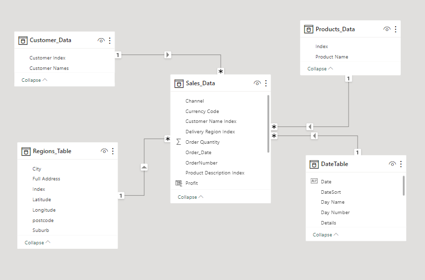
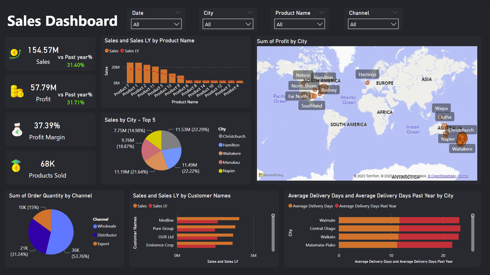
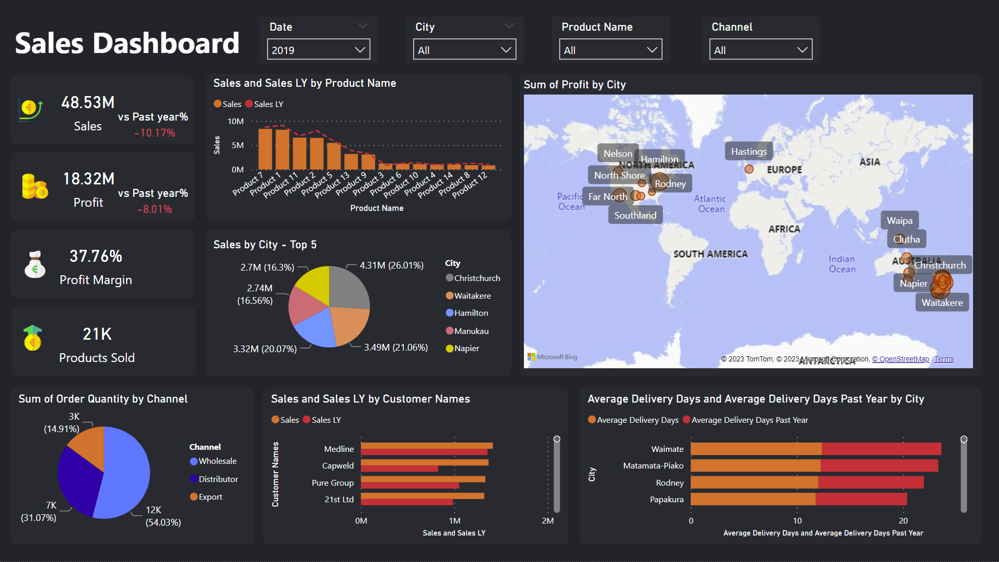

# Power BI Data Visualization Project - Sales-Dashboard
## Overview

This dataset contains information related to sales orders, customers, regions, and products. It is designed for data analysis and is structured into four main tables: Sales Orders, Customers, Regions, and Products. Additionally, a Date Table is created to support time-based analysis using Data Analysis Expressions (DAX) in Power BI.

## Tables

### 1. Sales Orders

- Columns:
  - Order Date
  - Ship Date
  - Customer Name Index
  - Channel
  - Currency Code
  - Warehouse Code
  - Delivery Region Index
  - Product Description Index
  - Order Quantity
  - Unit Selling Price
  - Unit Cost

### 2. Customers

- Columns:
  - Customer Index
  - Customer Names

### 3. Regions

- Columns:
  - Index
  - Suburb
  - City
  - Postcode
  - Longitude
  - Latitude
  - Full Address

### 4. Products

- Columns:
  - Index
  - Product Name

## DAX Measures

The Date Table is utilized for various time-based DAX measures, including but not limited to:

## Data Visualization
### Star Schema

### Dashboard

## Project Files
- `Sales.pbix`: The Power BI report file. You can open this file in Power BI Desktop to interact with the data visualizations and explore the insights.

## Usage
- Use the provided visualizations and filters in the Power BI report to gain insights into customer churn behavior and patterns.
- Customize or extend the report to answer specific business questions or explore additional aspects of the dataset.

## License
This project is licensed under the MIT License - see the [LICENSE](LICENSE) file for details.

Feel free to reach out if you have any questions or suggestions for improvements to this Power BI project.
